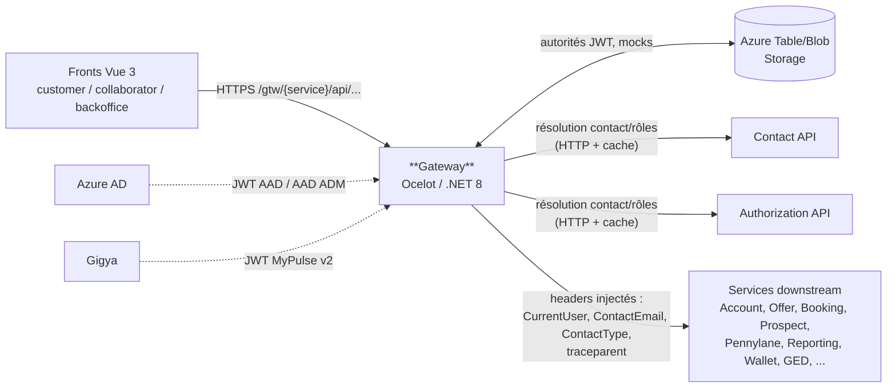

# Pulse.Back.Gateway — Architecture & Service Context

> **Document de contexte humain / agent IA.**
> L'inventaire factuel (routes gateway, endpoints, projets, packages internes)
> est porté par [`architecture.graph.yaml`](./architecture.graph.yaml), **régénéré automatiquement sur `main`**
> par la pipeline ArchGraph, et consolidé dans `pulse.graph.yaml` (topologie complète, edges `routes`)
> côté Pulse.Operations.Review.
> **Ne pas dupliquer ces listes ici** — ce document porte ce que le graphe ne dit pas :
> rôle, sécurité, pipeline de handlers, points d'attention, règles spécifiques.
>
> Point d'entrée agents : [`AGENTS.md`](./AGENTS.md) (conventions, 451 lignes) → ce fichier (contexte) → le graphe (facts).

---

## 1. Rôle du service

**Point d'entrée unique** de la plateforme Pulse (API Gateway Ocelot). Toute la sécurité applicative est portée ici — les microservices en aval n'ont **pas** de `[Authorize]` et font confiance aux headers injectés par la Gateway (isolation réseau par private endpoints).

Responsabilités :
- **Authentification JWT multi-IdP** : Azure AD (collaborateurs), Azure AD ADM (admins), Gigya (clients MyPulse)
- **Autorisation par route** : permissions par méthode HTTP (`RouteClaimsRequirement`, codes type `CLADMI001`)
- **Révocation de tokens** (logout) — vérifiée AVANT l'authentification
- **Injection de headers d'identité** vers l'aval : `CurrentUser`, `ContactEmail`, `ContactType`
- **Prévention BOLA** : `RoleHandler` vérifie que l'utilisateur a un rôle sur le compte ciblé
- **Routage** vers ~24 services downstream, agrégation de réponses, feature flags, mocks

### Vue d'ensemble des flux

> Vue synthétique **indicative** — la source de vérité de la topologie est le graphe consolidé `pulse.graph.yaml`.



---

## 2. Routage Ocelot

**Liste exhaustive des routes : [`architecture.graph.yaml`](./architecture.graph.yaml)** (section
`managed_by_script.gateway_routes`, générée depuis `ocelot.json`) ; vue par service downstream :
graphe consolidé `pulse.graph.yaml`, edges `routes`.

> **Contrat de référence** : `src/Config/ocelot.json` (production) — `src/ApiGateway/Configuration/ocelot.json` (dev, sous-ensemble).
> Convention upstream : `/gtw/{service}/api/...` → downstream `appcegpulse{trigramme}#{env_id}#01.azurewebsites.net`.

Anatomie d'une route :
```json
{
  "UpstreamPathTemplate": "/gtw/offer/api/subscription/{everything}",
  "AuthenticationOptions": { "AuthenticationProviderKeys": ["AAD", "GIGYA MyPulse v2"] },
  "RouteClaimsRequirement": { "GET": "CLADMI001,COADMI001", "POST": "CLPEN001,COINFO001" }
}
```
- `RouteClaimsRequirement` : codes permission par méthode HTTP, séparés par virgule = **OU logique**
- `DelegatingHandlers` : tableau optionnel de handlers par route (voir §4)

---

## 3. Authentification & autorisation

| Élément | Implémentation |
|---------|----------------|
| Schemes JWT | `AAD`, `AAD ADM`, `GIGYA MyPulse v2` — handler custom `PulseJwtBearerHandler` (multi-autorités) |
| Autorités | Chargées depuis **Azure Table Storage** au démarrage (repo Authority), config `Isvc*` |
| Politique par défaut | `RequireAuthenticatedUser()` (FallbackPolicy) — opt-out explicite par `[AllowAnonymous]` |
| Révocation tokens | `TokenRevocationMiddleware` **avant** `UseAuthentication()` — ids `jti` (standard) / `uti` (AAD) / `sub:iat` (Gigya), cache `IMemoryCache` (TTL = expiration token, **sticky sessions requises**) |
| Autorisation route | `AuthorizationMiddleware` (Ocelot) : permissions via Authorization API (`GetAllContactAuthorizationAsync`), 403 si manquantes |
| BOLA | `RoleHandler` (par route) : vérifie le rôle de l'utilisateur sur le compte/entité ciblé |

---

## 4. Pipeline & DelegatingHandlers

### Ordre du pipeline (Program.cs)
```
HttpLogging → ForwardedHeaders → Swagger → TokenRevocationMiddleware
→ Authentication → Health endpoint → Ocelot
   (PreErrorResponder: GatewayExceptionMiddleware → AuthorizationMiddleware)
```

### Handlers globaux (toutes les requêtes, dans l'ordre)
| # | Handler | Rôle |
|---|---------|------|
| 1 | `TraceContextHandler` | Propage `traceparent`/`tracestate` (W3C) vers l'aval |
| 2 | `ContactHandler` | Résout le contact depuis l'email du JWT (Contact API + cache) ; injecte `CurrentUser`, `ContactEmail`, `ContactType` (headers **nettoyés puis réinjectés** — anti-spoofing) |
| 3 | `DownstreamExceptionHandler` | Log des erreurs downstream (5xx = Error, sinon Warning) |
| 4 | `LogoutRevocationHandler` | Capte `X-Revoked-Jti`/`X-Revoked-Exp` des réponses logout → alimente le cache de révocation (headers retirés avant retour client) |
| 5 | `FeatureFlagGateHandler` | 403 si le feature flag de la route est désactivé (OpenFeature/ConfigCat) |
| 6 | `MockResponseHandler` | Substitue une réponse mock si présente (Table/Blob Storage) |

### Handlers par route (sélectifs)
| Handler | Routes | Rôle |
|---------|--------|------|
| `RoleHandler` | Account, Authorization, Contact, Booking… | Prévention BOLA |
| `ExposePrivilegedEndpointsHandler` | Routes admin | 403 sauf super-admin |
| `FeedCenterSettingsHandler` | FeedCenter | Injection config spécifique |
| `BookingSyncHandler` | Booking | Synchronisation avant forward |
| `ProspectExperienceHandler` | Prospect | Gate expérience prospect |
| `ApprovedPlatformFilterHandler` | Offer… | Filtre par plateforme approuvée |

### Erreurs
`GatewayException` (étend `BusinessException` de `Pulse.ExceptionMiddleware`) — codes `GTW001`–`GTW027+` (messages en français), transformées par `GatewayExceptionMiddleware` (PreErrorResponder Ocelot) en `ErrorResponse` JSON.

---

## 5. Posture sécurité — état réel

| Mécanisme | État dans le code |
|-----------|-------------------|
| Auth multi-IdP + FallbackPolicy | ✅ Présent |
| Révocation de tokens | ✅ Présent (mais cache local → sticky sessions) |
| BOLA (RoleHandler) | ✅ Présent sur les routes sensibles |
| Anti-spoofing headers identité | ✅ Présent (clear + réinjection) |
| **Rate limiting** | ❌ Absent (aucun `RateLimitOptions` Ocelot ni `AddRateLimiter`) |
| **CORS** | ❌ Non configuré dans le code (délégué à l'App Service / aval) |
| **Security headers** (HSTS, X-Content-Type-Options, CSP…) | ❌ Absents |
| **Swagger en production** | ⚠️ Actif dans tous les environnements (`UseSwaggerForOcelotUI` + `EnableTryItOutByDefault`) |
| Health checks | ⚠️ `/health` basique (pas d'agrégation downstream) |

> Ces écarts sont documentés dans le rapport qualité plateforme (`raapor-qualité.md`, constats C1/C3).
> ⚠️ Pour les agents IA : `AGENTS.md`/`CLAUDE.md` mentionnent « rate limiting, CORS » comme rôle de la Gateway — **ce n'est pas encore implémenté**. Ne pas supposer leur existence.

---

## 6. Dépendances

> Versions des packages internes : fragment (`managed_by_script.internal_packages`).

| Type | Cible | Usage |
|------|-------|-------|
| Azure Table Storage | autorités JWT, base des mocks | `Azure.Data.Tables` + Managed Identity |
| Azure Blob Storage | réponses mock | `Azure.Storage.Blobs` |
| HTTP (Polly retry) | Contact, Authorization, Account, Offer, Prospect, Registry, Mandate, Booking (60s), Gigya, Pennylane (30s) | Résolution identité/rôles, agrégations, features |
| Observabilité | Azure Monitor OpenTelemetry | Traces distribuées (traceparent propagé) |
| Feature flags | ConfigCat via OpenFeature | Gates de routes, targeting par SHA256(email) |
| Package Pulse | `Pulse.ExceptionMiddleware` | Gestion d'erreurs (**legacy**) |
| Cache | `IMemoryCache` (NRedisStack présent mais **non utilisé**) | Contacts, révocation, autorisations |

---

## 7. État migration

| Sujet | État actuel | Cible |
|-------|-------------|-------|
| .NET | net8.0 | .NET 10 (migration plateforme en cours) |
| Exceptions | `Pulse.ExceptionMiddleware` + `GatewayException`/`ErrorResponse` | `IExceptionHandler` + ProblemDetails (RFC 9457) — à adapter au pipeline Ocelot |
| Cache révocation | `IMemoryCache` local (sticky sessions) | Cache distribué (Redis déjà référencé) si scale-out |
| Rate limiting / CORS / security headers | Absents | À implémenter (Ocelot `RateLimitOptions` natif) |

---

## 8. Structure & CI

```
Pulse.Back.Gateway/
├── src/
│   ├── ApiGateway/               # Projet unique (PAS de Clean Architecture — feature folders)
│   │   ├── Program.cs            # Pipeline + Ocelot
│   │   ├── Configuration/ocelot.json    # Routes DEV
│   │   ├── DelegatingHandlers/   # 11 handlers
│   │   ├── Middlewares/          # TokenRevocation, Authorization, GatewayException
│   │   ├── Identity/ TokenRevocation/ Authorization/ FeatureFlags/
│   │   ├── Aggregator/           # 4 agrégateurs de réponses
│   │   └── {Contact,Account,Offer,Pennylane,...}/  # services scoped par feature
│   └── Config/ocelot.json        # Routes PROD (tokenisé #{env_id}#)
├── tests/ApiGateway.UnitTests/   # miroir 1:1 de src
└── pipelines/                    # 8 YAML Azure DevOps (PR, delivery, hotfix, update)
```

---

## 9. Règles spécifiques au service

- **Toute nouvelle route** doit définir `AuthenticationOptions` + `RouteClaimsRequirement` par méthode ; les routes exposant des ressources par id de compte doivent ajouter `RoleHandler` (BOLA).
- Modifier `src/Config/ocelot.json` (prod), pas seulement le fichier de dev — les deux fichiers divergent volontairement.
- Les `DelegatingHandlers` ne lèvent pas d'exceptions vers le client : log + comportement dégradé.
- La section « Exception boundaries » des conventions communes ne s'applique pas ici (`try/catch` autorisé en controller — pipeline Ocelot).
- Ne jamais logger les tokens ni les emails complets (PII).
