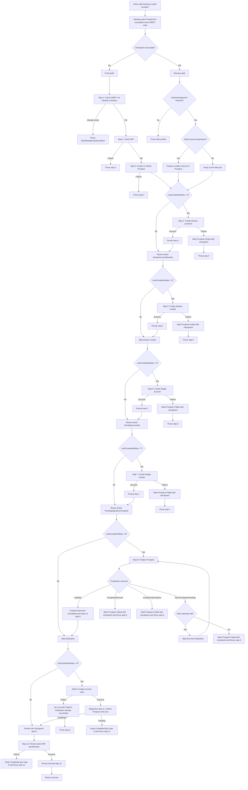
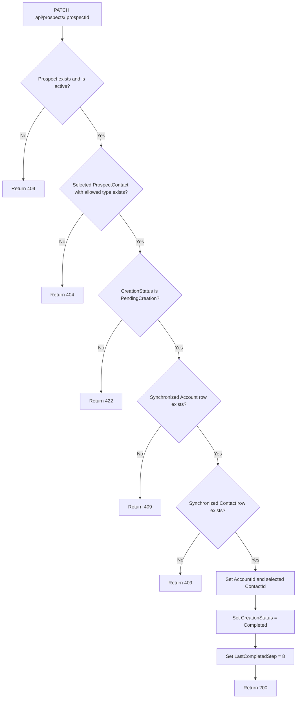
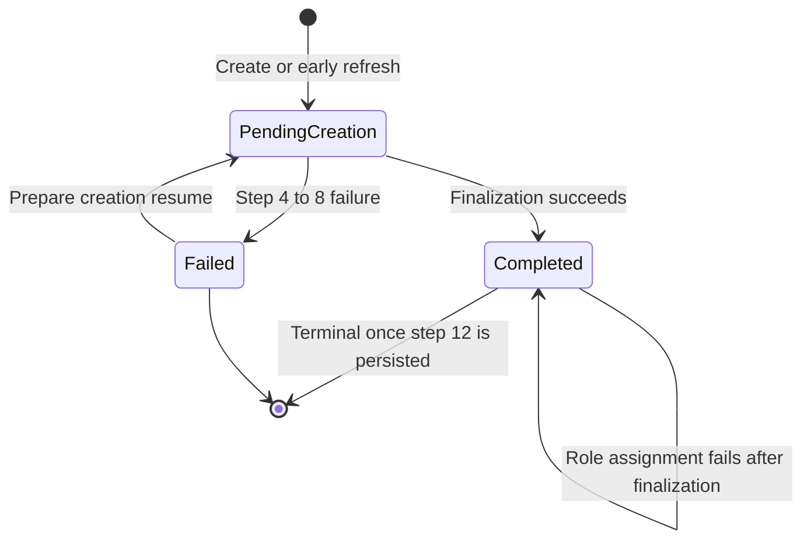

# Prospect Creation Orchestration Flow

## Objective

This document explains the final secured and resumable prospect creation orchestration implemented in:

- [ProspectOrchestrationService.cs](/C:/Users/obenamor/source/repos/Pulse.Back.Gateway/src/ApiGateway/ProspectExperience/Services/ProspectOrchestrationService.cs)
- [ProspectApiClient.cs](/C:/Users/obenamor/source/repos/Pulse.Back.Gateway/src/ApiGateway/ProspectExperience/Services/ProspectApiClient.cs)
- [ProspectsController.cs](/C:/Users/obenamor/source/repos/Pulse.Back.Prospect/src/Pulse.Back.Prospect.WebApi/Controllers/ProspectsController.cs)
- [ProspectService.cs](/C:/Users/obenamor/source/repos/Pulse.Back.Prospect/src/Pulse.Back.Prospect.Application/Services/ProspectService.cs)
- [ProspectRepository.cs](/C:/Users/obenamor/source/repos/Pulse.Back.Prospect/src/Pulse.Back.Prospect.Infrastructure/Repositories/ProspectRepository.cs)

The goal is:

- keep Account, Contact, and Role synchronization event-driven
- prevent premature Prospect finalization before synchronized stale-data rows exist locally in Prospect
- hide incomplete prospects from standard read endpoints
- allow a user retry to resume from the last safe checkpoint after partial external success
- avoid replaying a retry with a different payload once Akuiteo customer creation already happened

## Why the change was needed

The original Gateway flow behaved as if every downstream call were synchronous:

1. Create Prospect
2. Create Akuiteo customer
3. Create Akuiteo contact
4. Create Rydge account
5. Create Rydge contact
6. Patch Prospect with `AccountId` and the selected Prospect contact `ContactId`
7. Assign roles

That created two classes of failures:

1. Prospect finalization could be attempted before Prospect had consumed Account and Contact events.
2. A retry after partial external success could restart from step 1 and get blocked by the Akuiteo duplicate-SIRET check.

## Final implemented behavior

The final solution combines:

1. a technical lifecycle on Prospect:
   - `PendingCreation`
   - `Completed`
   - `Failed`
2. a persisted checkpoint on Prospect:
   - `LastCompletedStep`
   - `AkuiteoAccountNumber`
   - `PendingAccountId`
   - `PendingSignatoryContactId`
3. a computed resume payload fingerprint returned by Prospect:
   - `ResumeRequestFingerprint`
4. a bounded finalization retry in Gateway
5. a resume preparation endpoint that restores a failed pre-finalization prospect to a finalizable state
6. a bounded role-synchronization confirmation retry in Gateway before persisting the role checkpoint
7. an idempotent role retry behavior in Gateway that ignores downstream `ACC021` duplicate-role failures
8. a final idempotent beneficiary synchronization step that persists active INPI beneficial owners in Prospect

## Technical step numbering

The full orchestration runtime order is:

1. `1` = Check Akuiteo duplicate SIRET
2. `2` = Fetch INPI data
3. `3` = Create or refresh Prospect
4. `4` = Create Akuiteo customer
5. `5` = Create Akuiteo contact
6. `6` = Create Rydge account
7. `7` = Create Rydge contact
8. `8` = Finalize Prospect
9. `9` = Assign account roles
10. `12` = Persist active INPI beneficiaries

Only persisted Prospect checkpoints use `LastCompletedStep`, and they start at `3`.
`LastCompletedStep = 12` is the terminal successful state.

Gateway uses diagnostic-only steps that are never persisted in `LastCompletedStep`:

10. `10` = Prepare creation resume before a pre-finalization retry
11. `11` = Confirm role synchronization in Prospect before persisting role checkpoint step `9`

Gateway no longer sends these numeric step values back to Prospect for checkpoint persistence.
For shared checkpoint updates, Gateway sends a semantic `CompletedMilestone` value and Prospect maps it internally to its persisted `LastCompletedStep`.

## Prospect technical model

Prospect persists:

- `CreationStatus`
- `LastCompletedStep`
- `AkuiteoAccountNumber`
- `PendingAccountId`
- `PendingSignatoryContactId`

Prospect also computes and returns:

- `CompletedMilestone`
- `ResumeRequestFingerprint`

### Meaning of the fields

- `CreationStatus` controls lifecycle and standard-read visibility.
- `LastCompletedStep` identifies the last confirmed persisted checkpoint inside Prospect.
- `CompletedMilestone` identifies the last Gateway-owned semantic milestone that Prospect reports back for resume decisions.
- `AkuiteoAccountNumber` allows Gateway to reuse the already-created Akuiteo customer.
- `PendingAccountId` allows Gateway to reuse the already-created Rydge account before finalization succeeds.
- `PendingSignatoryContactId` allows Gateway to reuse the already-created Rydge contact selected during creation before finalization succeeds.
- `ResumeRequestFingerprint` prevents Gateway from resuming with a different creation payload after step 4.

For the shared orchestration checkpoints, Gateway reports the following semantic `CompletedMilestone` values to Prospect:

- `AkuiteoCustomerCreated`
- `AkuiteoContactCreated`
- `RydgeAccountCreated`
- `RydgeContactCreated`
- `RolesAssigned`
- `BeneficiariesPersisted`

Prospect then maps these milestones internally to persisted steps `4`, `5`, `6`, `7`, `9`, and `12`.
Steps `3` and `8` remain owned directly by Prospect because they are persisted inside Prospect's own aggregate transitions.
When Prospect later returns an incomplete checkpoint to Gateway, it also returns the corresponding `CompletedMilestone` so Gateway can resume and mark failures without re-deriving milestones from persisted numeric steps.

`PendingSignatoryContactId` keeps its historical name in code, but it now stores the Rydge contact selected from the Prospect contact chosen by the user for creation finalization. That selected Prospect contact can carry multiple contact types.

## Prospect lifecycle

### Creation or early retry

When Prospect is created or refreshed from the same SIRET before step 4:

- `CreationStatus = PendingCreation`
- `LastCompletedStep = 3`
- `AkuiteoAccountNumber = null`
- `PendingAccountId = null`
- `PendingSignatoryContactId = null`

### Pre-finalization failure

If Gateway fails after Prospect exists but before Prospect finalization succeeds:

- Gateway calls `PATCH /api/prospects/:prospectId/creation-failure`
- Prospect stores the latest known checkpoint fields from Gateway
- Prospect sets `CreationStatus = Failed`
- Prospect stays hidden from standard read endpoints

### Resume preparation

If Gateway later wants to resume a failed checkpoint whose `4 <= LastCompletedStep < 8`:

- Gateway first calls `PATCH /api/prospects/:prospectId/prepare-creation-resume`
- Prospect restores `CreationStatus = PendingCreation`
- the stored checkpoint fields are kept
- if this preparation call fails, Gateway reports a dedicated diagnostic step `10` instead of incorrectly reporting step `3`

### Finalization

When Gateway calls `PATCH /api/prospects/:prospectId`, Prospect verifies:

- the Prospect exists and is active
- a selected ProspectContact exists with at least one allowed contact type
- `CreationStatus == PendingCreation`
- the synchronized `Account` stale-data row exists with the expected `AccountId` and `AccountNumber`
- the synchronized `Contact` stale-data row exists with the expected selected `ContactId`

The selected Prospect contact is the contact chosen by the user in the creation payload. It may contain multiple `ProspectContactTypes`. Finalization accepts it when at least one of its types belongs to the allowed set currently supported by Prospect:

- `SIGNATAIRE`
- `COFFRE_FORT_NUMERIQUE`
- `RECOUVREMENT`

If the checks pass:

- `Prospect.AccountId` is updated
- the selected Prospect contact `ContactId` is updated
- `CreationStatus = Completed`
- `LastCompletedStep = 8`
- checkpoint fields remain populated

### Post-finalization role failure

If finalization has already succeeded and role assignment fails afterward:

- Gateway does not mark Prospect as `Failed`
- Prospect stays `Completed`
- `LastCompletedStep` stays `8`
- the incomplete same-SIRET lookup still returns this Prospect because it has not reached terminal step `12`
- the next user retry resumes directly at role assignment

If Account role creation succeeds but Prospect has not consumed the corresponding role events yet:

- Gateway does not persist `LastCompletedStep = 9`
- Gateway waits for a short bounded role-synchronization confirmation against Prospect
- Prospect stays `Completed`
- `LastCompletedStep` stays `8`
- the next user retry still resumes directly at role assignment / role-synchronization confirmation

### Post-role beneficiary persistence

After role assignment and role synchronization succeed:

- Gateway persists `RolesAssigned` as checkpoint step `9`
- Gateway calls `POST /api/prospects/:prospectId/beneficiaries`
- Prospect retrieves the company from INPI by the prospect SIRET
- Prospect extracts only beneficiaries where INPI `actif == true`
- beneficiaries from both `personneMorale` and `personnePhysique` are supported
- Prospect replaces the persisted set and deduplicates by `(ProspectId, ExternalId)`
- Gateway persists `BeneficiariesPersisted` as terminal checkpoint step `12`

If beneficiary persistence fails, Prospect remains `Completed` at step `9`. The next retry skips all
creation and role steps and retries only beneficiary persistence.

## Prospect read behavior

Standard Prospect read endpoints require:

- `CreationStatus = Completed`
- the existing account/role access predicates already present before this change

This applies at least to:

- `GET /api/prospects`
- `GET /api/entity-count`

As a result:

- `PendingCreation` prospects stay hidden
- `Failed` prospects stay hidden
- a post-finalization role failure does not hide the prospect through lifecycle status, but normal access still depends on the account roles being available

## Gateway orchestration behavior

Gateway now does this:

1. ask Prospect for an incomplete same-SIRET state
2. if no resumable state exists, execute the fresh path
3. if a resumable state exists:
   - reject the retry if the current request payload fingerprint differs from the stored one
   - prepare the prospect for resume when the lifecycle must be restored to `PendingCreation`
   - skip every already-completed downstream step
4. retry Prospect finalization only against Prospect when synchronized stale-data rows are still not ready
5. assign roles only after finalization succeeds
6. confirm in Prospect that the expected synchronized role rows exist locally
7. persist `LastCompletedStep = 9` after role assignment and Prospect role synchronization confirmation succeed
8. persist active INPI beneficiaries and then persist terminal `LastCompletedStep = 12`

## Full orchestration flow

## Prospect-side finalization decision logic

## Prospect lifecycle state diagram

### How to read this lifecycle

- `PendingCreation` means Prospect exists but is not visible in standard reads.
- `Failed` means a pre-finalization stop was recorded together with a resumable checkpoint.
- `Completed` means Prospect finalization succeeded.
- `Completed` does not automatically mean the full Gateway orchestration is terminal.
- The full workflow becomes terminal only after beneficiary persistence succeeds and Gateway persists `LastCompletedStep = 12`.

## Exact behavior by failure point

### Case 1: failure before Prospect exists

This covers:

- step 1
- step 2
- step 3

Behavior:

- Gateway stops immediately
- no Prospect failure marking is attempted
- the next click restarts from the beginning

### Case 2: failure during Akuiteo customer creation

This covers:

- step 4 fails before the customer is created

Behavior:

- Prospect already exists
- `LastCompletedStep` remains `3`
- Gateway marks Prospect as `Failed`
- the next click uses the fresh path again
- Prospect create refreshes the same row and clears checkpoint fields

### Case 3: Akuiteo customer exists, then Akuiteo contact fails

This covers:

- step 4 succeeded
- step 5 failed

Behavior:

- Prospect stores `LastCompletedStep = 4`
- Prospect stores `AkuiteoAccountNumber`
- Prospect is marked `Failed`
- the next click does not rerun the Akuiteo duplicate-SIRET check
- Gateway restores `PendingCreation` and resumes directly from step 5

### Case 4: Rydge account creation fails after Akuiteo contact success

This covers:

- step 5 succeeded
- step 6 failed

Behavior:

- Prospect stores `LastCompletedStep = 5`
- the next click restores `PendingCreation`
- Gateway resumes directly from step 6

### Case 5: Rydge contact creation fails after Rydge account success

This covers:

- step 6 succeeded
- step 7 failed

Behavior:

- Prospect stores `LastCompletedStep = 6`
- Prospect stores `PendingAccountId`
- the next click restores `PendingCreation`
- Gateway resumes directly from step 7

### Case 6: finalization waits for synchronized stale data

This covers:

- step 7 succeeded
- Prospect finalization returns `SynchronizationPending`

Behavior during the same HTTP request:

- Gateway retries only the Prospect finalization call
- Gateway does not retry Account or Contact creation

Behavior after retry exhaustion:

- Prospect keeps the checkpoint from step 7
- Gateway marks Prospect as `Failed`
- the next click restores `PendingCreation`
- Gateway resumes directly from finalization

### Case 7: role assignment fails after Prospect finalization succeeded

This covers:

- step 8 succeeded
- step 9 failed

Behavior:

- Prospect stays `Completed`
- `LastCompletedStep` stays `8`
- Gateway does not mark Prospect as `Failed`
- the next click resumes directly at role assignment
- duplicate role failures with downstream code `ACC021` are ignored during the retry
- on success, Gateway first confirms local role synchronization in Prospect, then persists `LastCompletedStep = 9`

### Case 8: beneficiary persistence fails after roles are assigned

This covers:

- step 9 succeeded
- step 12 failed while calling Prospect or persisting its terminal checkpoint

Behavior:

- Prospect stays `Completed`
- `LastCompletedStep` stays `9`
- Gateway does not mark Prospect as `Failed`
- the next click resumes directly at beneficiary persistence
- the endpoint replaces the beneficiary set, so retrying after a partial success does not create duplicates

### Case 9: retry payload changed after step 4

This covers:

- a user retries the same SIRET
- an incomplete checkpoint already exists from step 4 or later
- the retry payload differs from the persisted Prospect payload

Behavior:

- Prospect returns the stored `ResumeRequestFingerprint`
- Gateway compares it to the current request fingerprint
- Gateway rejects the retry with `409 Conflict`
- no resume step is executed

## Internal Prospect endpoints used by Gateway

- `GET /api/prospects/incomplete-by-siret/{siret}`
- `PATCH /api/prospects/{prospectId}/prepare-creation-resume`
- `PATCH /api/prospects/{prospectId}/creation-progress`
- `PATCH /api/prospects/{prospectId}/creation-failure`
- `PATCH /api/prospects/{prospectId}`
- `POST /api/prospects/{prospectId}/beneficiaries`

The Mermaid diagrams in this document intentionally use `:prospectId` and `:siret` placeholder syntax because Mermaid does not parse `{...}` placeholders reliably inside node labels.

### Endpoint responsibilities

- `incomplete-by-siret` returns the resumable checkpoint and the payload fingerprint.
- `prepare-creation-resume` restores `PendingCreation` before a pre-finalization resume.
- `creation-progress` persists the technical checkpoint after each successful step by receiving a semantic `CompletedMilestone` from Gateway and mapping it internally to the persisted `LastCompletedStep`.
- `creation-failure` stores the last known checkpoint together with `CreationStatus = Failed`.
- `creation-failure` also receives the last successfully completed semantic milestone when that checkpoint is Gateway-owned, and omits it when the latest persisted checkpoint is still owned directly by Prospect.
- `PATCH /api/prospects/:prospectId` finalizes Prospect only when synchronized stale-data rows are ready.
- `POST /api/prospects/:prospectId/beneficiaries` replaces the prospect beneficiary set with active INPI owners and is safe to retry.

## Important technical decisions

- no distributed transaction
- no physical deletion rollback
- event-driven synchronization remains unchanged
- finalization retry stays local to Prospect because Prospect owns read-model readiness
- retry after partial success is a resume, not a full replay
- retry after step 4 requires the same business payload
- role retry after finalization is tolerated because Gateway ignores downstream duplicate-role code `ACC021`
- beneficiary retry after role assignment is tolerated because Prospect replaces and deduplicates the active set

### INPI beneficiary mapping assumptions

- `actif` is the source-of-truth active flag; only `true` rows are persisted.
- `beneficiairesEffectifs` is read from both `personneMorale` and `personnePhysique`.
- `beneficiaireId` is required for persistence and becomes `ExternalId`; rows without it are ignored because they cannot be safely deduplicated.
- The requested persistence mapping is intentionally `nom -> FirstName`.
- `prenoms` can be a string or a list. It is normalized to a list and only the first value is persisted as `LastName` while the final business rule remains under discussion.
- Synchronization replaces the full persisted set so inactive or removed INPI beneficiaries are deleted locally.

## Files to inspect when the flow evolves

Gateway:

- [ProspectOrchestrationService.cs](/C:/Users/obenamor/source/repos/Pulse.Back.Gateway/src/ApiGateway/ProspectExperience/Services/ProspectOrchestrationService.cs)
- [ProspectApiClient.cs](/C:/Users/obenamor/source/repos/Pulse.Back.Gateway/src/ApiGateway/ProspectExperience/Services/ProspectApiClient.cs)
- [ProspectResumePolicy.cs](/C:/Users/obenamor/source/repos/Pulse.Back.Gateway/src/ApiGateway/ProspectExperience/Policies/ProspectResumePolicy.cs)
- [ProspectResumeRequestFingerprint.cs](/C:/Users/obenamor/source/repos/Pulse.Back.Gateway/src/ApiGateway/ProspectExperience/Policies/ProspectResumeRequestFingerprint.cs)

Prospect:

- [ProspectsController.cs](/C:/Users/obenamor/source/repos/Pulse.Back.Prospect/src/Pulse.Back.Prospect.WebApi/Controllers/ProspectsController.cs)
- [ProspectService.cs](/C:/Users/obenamor/source/repos/Pulse.Back.Prospect/src/Pulse.Back.Prospect.Application/Services/ProspectService.cs)
- [ProspectRepository.cs](/C:/Users/obenamor/source/repos/Pulse.Back.Prospect/src/Pulse.Back.Prospect.Infrastructure/Repositories/ProspectRepository.cs)
- [ProspectCreationStatus.cs](/C:/Users/obenamor/source/repos/Pulse.Back.Prospect/src/Pulse.Back.Prospect.Domain/Entities/Prospects/ProspectCreationStatus.cs)
- [ProspectCreationSteps.cs](/C:/Users/obenamor/source/repos/Pulse.Back.Prospect/src/Pulse.Back.Prospect.Domain/Entities/Prospects/ProspectCreationSteps.cs)
- [ProspectResumeRequestFingerprint.cs](/C:/Users/obenamor/source/repos/Pulse.Back.Prospect/src/Pulse.Back.Prospect.Application/Services/ProspectResumeRequestFingerprint.cs)

## Validation points

- `CreationStatus` and `LastCompletedStep` remain coherent while serving different purposes: lifecycle visibility for `CreationStatus`, and resumable checkpoint position for `LastCompletedStep`.
- pre-finalization retries restore `PendingCreation` before Prospect finalization is attempted again.
- post-finalization role failures no longer hide the prospect through lifecycle status.
- finalization still requires synchronized Account and Contact rows to exist locally in Prospect.
- Gateway never resumes a step-4+ checkpoint with a different creation payload.

## Open technical topic

### Office code in retry fingerprint

The current front-end creation payload does not send `OfficeCode`.

Gateway still exposes `OfficeCode` on the internal creation model and forwards it to Account contact creation when present, but Prospect does not persist this value and it is not part of `ResumeRequestFingerprint`.

This means the current retry-protection mechanism covers the business payload persisted by Prospect, but not a potential future `OfficeCode` value unless the contract changes. This should be reviewed with the tech lead before making `OfficeCode` user-provided or operationally significant for prospect creation retries.
